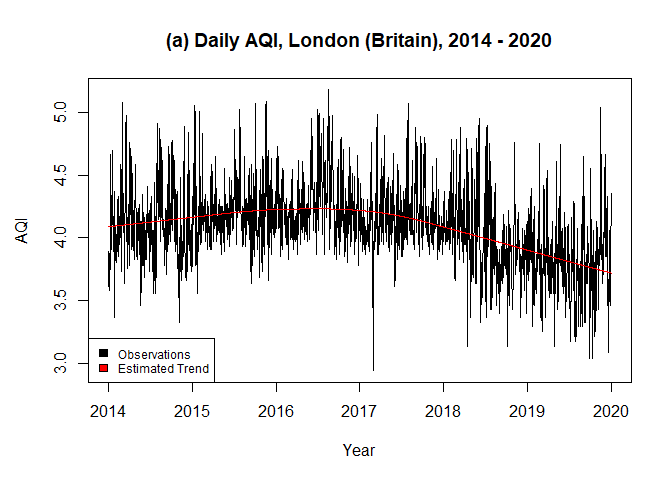

<!-- README.md is generated from README.Rmd. Please edit that file -->

# esemifar

<!-- badges: start -->

[](https://CRAN.R-project.org/package=esemifar)
[](https://lifecycle.r-lib.org/articles/stages.html#stable)
<!-- badges: end -->

The goal of `esemifar` is to provide an easy way to estimate the
nonparametric trend and its derivatives in trend-stationary, equidistant
time series with long-memory stationary errors. The main functions allow
for data-driven estimates via local polynomial regression with an
automatically selected optimal bandwidth.

## Installation

You can install the released version of `esemifar` from
[CRAN](https://CRAN.R-project.org) with:

``` r
install.packages("esemifar")
```

## Example 1: Estimation of the nonparametric trend function

This is a basic example which shows you how to solve a common problem.
The data `airLDN` in the package contains daily observations of the air
quality index of London (Britain) from 2014 to 2020. The data was
obtained from the European Environment Agency. To make use of the
`esemifar` package, it has to be assumed that the data follows an
additive model consisting of a deterministic, nonparametric trend
function and a zero-mean stationary rest with long-range dependence.

``` r
library(esemifar)          # Call the package
```

``` r
data <- airLDN           # Call the 'airLDN' data frame
Yt <- log(data$AQI)      # log-transform the data and store the actual values as a vector 

# Estimate the trend function via the 'esemifar' package
results <- tsmoothlm(Yt, p = 1, qmax = 1, pmax = 1, InfR = "Var")

# Easily access the main estimation results
b.opt <- results$b0             # The optimal bandwidth
trend <- results$ye             # The trend estimates  
resid <- results$res            # The residuals
b.opt
#> [1] 0.2423177
coef(results$FARMA.BIC)         # The model parameters
#>         d        ar 
#> 0.1032687 0.5435804
```



An optimal bandwidth of 0.2423177 was selected by the iterative plug-in
algorithm (IPI) within `tsmoothlm()`. A FARIMA (1, *d*, 0) was obtained
from the trend-adjusted residuals with *d̂* = 0.1032687 and
*ϕ̂* = 0.5435804. Moreover, the estimated trend fits the data suitably
and the residuals seem to be stationary.

## Further applications

The trend estimation function can also be used for the implementation of
semiparametric generalized autoregressive conditional heteroskedasticity
(Semi-GARCH) models with long memory in Financial Econometrics (see
Letmathe et al., 2021).

## Functions

In `esemifar` three functions are available.

**Original functions since version 1.0.0:**

-   `dsmoothlm`: Data-driven Local Polynomial for the Trend’s
    Derivatives in Equidistant Time Series
-   `critMatlm`: FARIMA Order Selection Matrix
-   `tsmoothlm`: Advanced Data-driven Nonparametric Regression for the
    Trend in Equidistant Time Series

**Data Sets**

-   `airLDN`: Daily observations of individual air pollutants from 2014
    to 2020
-   `gdpG7`: Quarterly G7 GDP between Q1 1962 and Q4 2019
